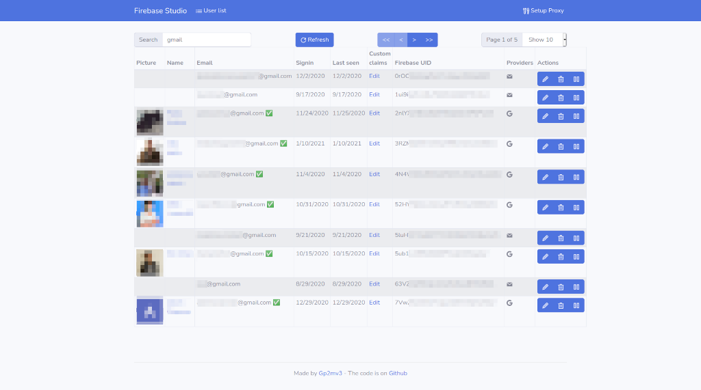
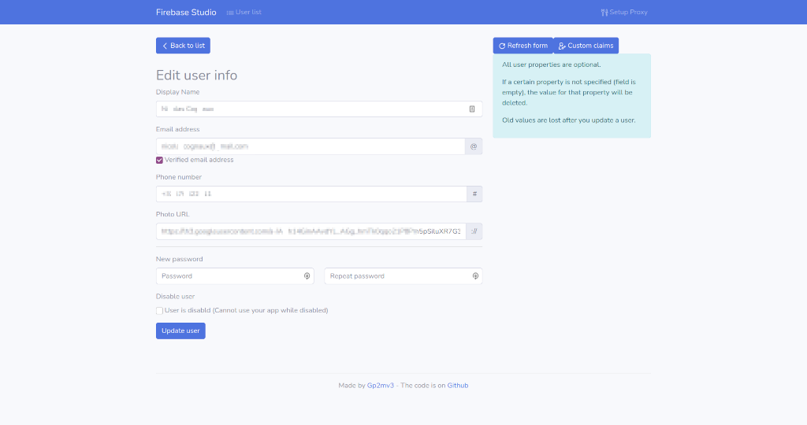
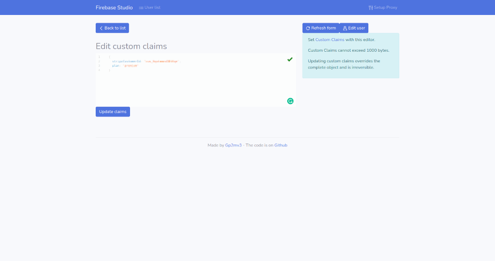
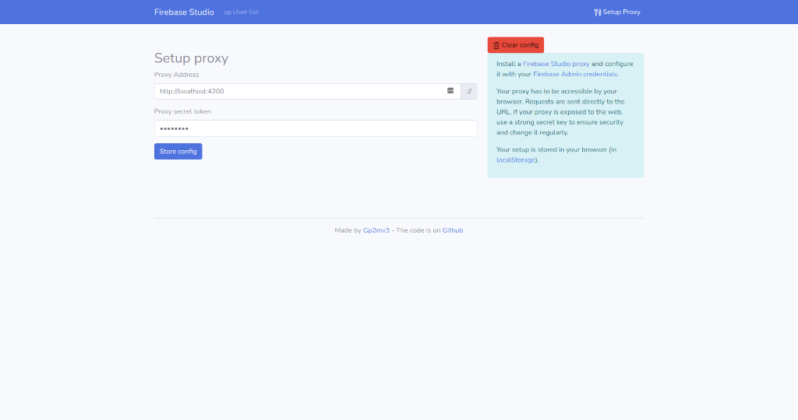

## Firebase Studio ([Open Client](https://gp2mv3.github.io/firebase-studio/))

This tool helps to manage Firebase authentication users. It's a "super firebase console".

It includes:

- A better search for users
- A clearer list (with all fields, including picture, full email address, name,...)
- The possibility to see and edit custom claims associated to a user
- The possibility to edit any information related to a specific user

## How to use:

The project is composed of two elements:
- The client: The web interface, built with React ([available here](https://gp2mv3.github.io/firebase-studio/))
- The proxy: Interface between Firebase admin SDK and the client, built with Node and Express

The client is available online: https://gp2mv3.github.io/firebase-studio/

### Environment variables for Admin SDK

Firebase Studio uses the [Firebase Admin SDK](https://firebase.google.com/docs/admin/setup) and needs to be initialized to use your own Firebase credentials.
You need to set the `GOOGLE_APPLICATION_CREDENTIALS` environment variable. Refer to the [official documentation for the initialization](https://firebase.google.com/docs/admin/setup#initialize-sdk).

### Proxy

Simply load the proxy, in the `proxy` folder, run (after `npm install`):
```
cd proxy
npm install # Only needed once

FIREBASE_STUDIO_SECRET=mysecret npm start
```

#### Configuration
Proxy can be configured through environment variables. Here are the available parameters:

- `GOOGLE_APPLICATION_CREDENTIALS`: Path to your Google Cloud credentil file (.json) **(required)**
- `FIREBASE_STUDIO_SECRET`: Secret keys used by the client to authenticate to the proxy. This key is not required but really advised if your proxy is accessible from the web. Use a strong random string.
- `PORT`: Port used by the proxy (by default: 4000)

### Client

The client is available on https://gp2mv3.github.io/firebase-studio/ and can be used as-is.

In dev, you can simply use `npm start` (after `npm install`) in the client folder:
```
cd client
npm install # Only needed once
npm start
```

In prod, compile the application with `npm build` (after `npm install`) and host the content of the build folder on any static file hosting:
```
cd client
npm install # Only needed once
npm build
```

## Found a bug?

Feel free to open an issue!

## Screenshots
Some screenshots of the client interface (Available here: https://gp2mv3.github.io/firebase-studio/ )





